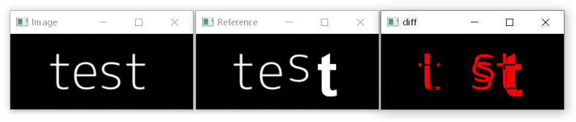
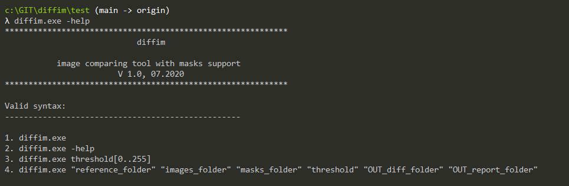
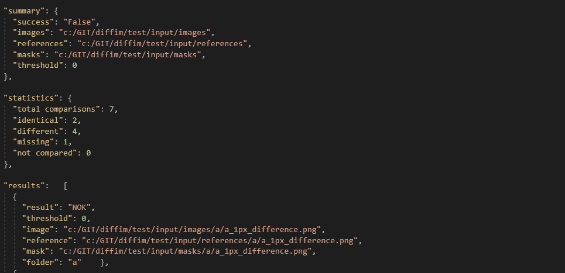

# diffim
Open-source, command-line, image comparing tool with masks support.

 

## Key Features
* generates diff images to help you quickly spot the differences
* compares full images or regions of interest
* adjustable comparison threshold
* generates a full json report 
* generates a simplified csv report
* image comparison implemented using OpenCV 

## How to use
To start a comparison using default parameters:
```js 
> diffim.exe
```

The input-output folder structure is automatically created at first run. Place the images, references and masks in these folders to have them compared:

```js
├───input\
│   ├───images
│   ├───masks
│   └───references
│   
├───output
│   ├───diff
│   ├───comparison.json
│   └───comparison.csv
│
└───diffim.exe
```
For every image found in `references` (including subfolders), a corresponding image is searched in `images` and the proper mask is searched in `masks`.
If no mask is found, the full image is compared. If a folder mask (or a specific mask) is found, only the region defined by the mask is compared.
The generated `diff` images for all images which differ are placed in the `output\diff` folder. The reports are stored in the  `output` folder.
 
\
To start a comparison using the default local folders and a custom threshold of 10:
```js 
> diffim.exe 10
```

\
To start a comparison using custom paths and a custom threshold:
```js 
> diffim.exe "reference_folder" "images_folder" "masks_folder" "threshold" "OUT_report_folder" "OUT_diff_folder"
```

\
To get the latest syntax, run the help command:
```js 
> diffim.exe -help
```

 


## Reports
Every comparison generates a full .json report (+ a simplified .csv one).  
The report includes a comparison summary, statistics (e.g. number of identical images) and detailed data:

 


## Compare only regions of interest

Define your regions of interest as masks and place them in the `masks` folder.

You can define `Specific Masks`, which apply to specific images and must be named as the images themselves or
you can define `Folder Masks` which apply to all images within a folder (except the ones which have specific masks defined) and must be named `_mask.png`.

The `test` folder includes these two types of masks. Check them out.


## Installation
### Install OpenCV
The image comparison algorithm is based on OpenCV. To install OpenCV:
1. download [OpenCV 4.5.2](https://sourceforge.net/projects/opencvlibrary/files/4.5.2/opencv-4.5.2-vc14_vc15.exe/download) and extract it to c:\ => C:\opencv folder is created
1. add a new environmental variable OPENCV_DIR=c:\opencv\build\x64\vc15
1. add C:\opencv\build\x64\vc15\bin\ to the Path environmental variable.

